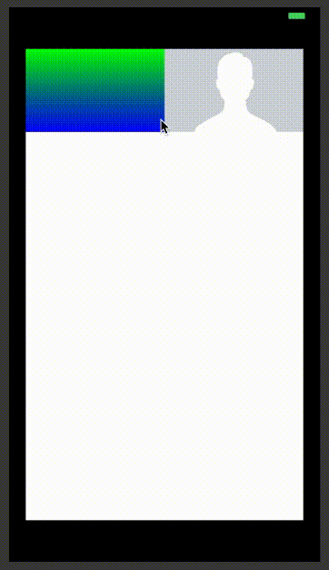

# StretchyHeader
Example of how to create a strechable header for your UIScrollView.

## StretchyGradient
Create the stretchy UIView with a gradient on top of the UIScrollView.

## StretchyImageView
Create the stretchy UIImageView UIView on top of the UIScrollView

Example:
´´´
 //Create a background view
        let background = UIView(frame: CGRect(x: 20, y: 50, width: self.view.frame.size.width - 40, height: self.view.frame.size.height - 100))
        background.backgroundColor = .red
        self.view.addSubview(background)
        
        //Create a UIScrollView view
        let scroll = UIScrollView(frame: background.bounds)
        scroll.backgroundColor = .white
        scroll.isUserInteractionEnabled = true
        scroll.showsHorizontalScrollIndicator = false
        scroll.isScrollEnabled = true
        background.addSubview(scroll)
        
        let halfWidth = background.frame.size.width / 2
        
        //create a container for the Stretchy Gradient and add it to the scroll view
        let stretchGradientContainer = UIView(frame: CGRect(x: 0, y: 0, width: halfWidth, height: 100))
        stretchGradientContainer.backgroundColor = .white
        scroll.addSubview(stretchGradientContainer)
        
        //Create the StretchyGradient and add it to its container
        let stretchGradient = StretchyGradient(frame: stretchGradientContainer.bounds,
                                               color1: .green,
                                               color2: .blue)
        stretchGradientContainer.addSubview(stretchGradient)
        
        //call the method to make the gradient stretchy
        stretchGradient.makeViewStretchy(bindTopToView: background)
        
        //Create the StretchyImageView
        let stretchImage = StretchyImageView(frame:CGRect(x: halfWidth, y: 0, width: halfWidth, height: 100),
                                             image: UIImage(named: "example") ?? UIImage())
        scroll.addSubview(stretchImage)
        
        //call the method to make the imageview stretchy
        stretchImage.makeImageStretchy(bindTopToView: background)
        
        //set scroll content size bigger than the scroll size, so you can scroll
        scroll.contentSize = CGSize(width: 10, height: scroll.frame.size.height*2)
        
